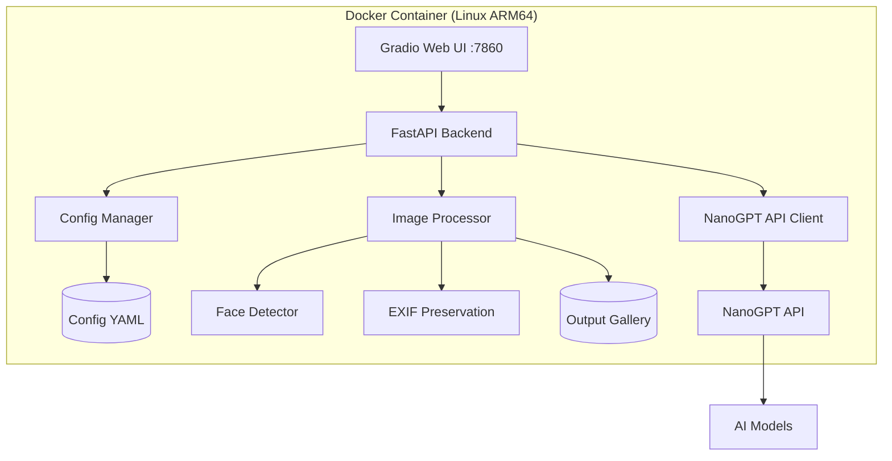

# SparkleImage - AI Photo Repair & Enhancement Tool

## Overview
A containerized Python web application (Gradio UI) that connects to NanoGPT AI models to perform photo restoration, colorization, inpainting, upscaling, denoising, and general enhancement. Optimized for ARM64/Ampere Linux servers.

## Architecture



## Tech Stack
- **Language**: Python 3.11+
- **UI**: Gradio (excellent for image-heavy interfaces, drag-and-drop, sliders, galleries)
- **HTTP Client**: `httpx` (async, robust)
- **Image Processing**: Pillow, OpenCV-Python
- **Face Detection**: `insightface` or `opencv-contrib-python` (dnn face detector)
- **Config**: `pydantic-settings` with YAML persistence
- **Container**: Docker multi-stage build, ARM64 base image
- **Process Management**: `supervisord` or simple `uvicorn` entrypoint

## Core Modules

### 1. Configuration System (`config/`)
- Pydantic model for settings: `api_url`, `api_key`, `model`, `max_resolution`, `default_prompts`, `face_preservation_strength`
- YAML read/write with validation
- UI settings panel in Gradio to update and save

### 2. NanoGPT Client (`clients/`)
- Async HTTP client with retry logic, timeouts, streaming progress
- Handles image base64 encoding/decoding
- Supports both chat completions and image generation endpoints
- Error handling for rate limits, invalid keys, model unavailability

### 3. Image Processing Pipeline (`processors/`)
Each feature is a modular pipeline:
- **Colorize**: B&W/sepia to color with era-appropriate tones
- **Repair**: Crease/tear restoration using inpainting + reconstruction
- **Inpaint/Remove**: User-defined mask → object removal + background fill
- **Upscale**: 2x/4x resolution increase with detail enhancement
- **Denoise**: Grain/scanner noise reduction
- **Enhance**: General clarity, contrast, color balance improvement
- **Scratch Removal**: Dedicated thin-line scratch detection and removal

### 4. Face Preservation (`utils/face.py`)
- Pre-process: Detect faces with OpenCV DNN or InsightFace
- Post-process: Compare before/after face embeddings to ensure identity retention
- Automatic prompt injection: "Preserve all facial features, keep the person recognizable, maintain eye color and expression"
- Optional: Face-aware masking to exclude faces from aggressive processing

### 5. Gradio Web UI (`ui/`)
- **Main Tab**: Upload image → Select operation → Configure parameters → Process
- **Tools Tab**: Interactive mask drawing for inpainting (Gradio `Image` tool with sketch)
- **Batch Tab**: Multi-image upload with same operation applied to all
- **Gallery Tab**: History of processed images with download links
- **Settings Tab**: API configuration, model selection, default parameters
- **Compare View**: Side-by-side before/after with zoom/pan

## Suggested Additional Features
1. **Metadata Preservation**: Retain EXIF data (date taken, camera, GPS) in output
2. **Scratch Removal**: Dedicated thin-line/scratch detection and removal pipeline
3. **Red-eye Removal**: Automated red-eye detection and correction
4. **Background Blur/Replace**: Portrait enhancement with background manipulation
5. **Style Transfer**: Convert to oil painting, sketch, or vintage look
6. **Auto-crop & Straighten**: Detect horizons/edges and suggest crops
7. **Watermark Removal**: Inpaint watermarks (with ethical safeguards)
8. **Restoration Pipeline**: Chain multiple operations (e.g., denoise → repair → colorize → upscale)
9. **Progress Tracking**: Real-time progress bars for long operations
10. **Queue System**: Prevent memory overload on concurrent requests

## Docker & Deployment
- **Base Image**: `python:3.11-slim-bookworm` (ARM64 native)
- **Multi-stage build**: Separate build dependencies from runtime
- **Volumes**:
  - `./config:/app/config` - Persistent settings
  - `./output:/app/output` - Processed images
  - `./uploads:/app/uploads` - Temporary uploads
- **Environment Variables**: Override config values (e.g., `NANOGPT_API_KEY`)
- **Healthcheck**: Endpoint to verify API connectivity

## Project Structure
```
SparkleImage/
├── app/
│   ├── __init__.py
│   ├── main.py              # Gradio launch + FastAPI mount
│   ├── config/
│   │   ├── __init__.py
│   │   ├── models.py        # Pydantic settings
│   │   └── manager.py       # YAML load/save
│   ├── clients/
│   │   ├── __init__.py
│   │   └── nanogpt.py       # API client
│   ├── processors/
│   │   ├── __init__.py
│   │   ├── base.py          # Abstract pipeline
│   │   ├── colorize.py
│   │   ├── repair.py
│   │   ├── inpaint.py
│   │   ├── upscale.py
│   │   ├── denoise.py
│   │   ├── enhance.py
│   │   └── scratch.py
│   ├── utils/
│   │   ├── __init__.py
│   │   ├── face.py          # Face detection & validation
│   │   ├── image.py         # Helpers (resize, encode, exif)
│   │   └── prompts.py       # System prompts per operation
│   └── ui/
│       ├── __init__.py
│       ├── app.py           # Gradio interface definition
│       ├── components.py    # Reusable UI blocks
│       └── tabs/
│           ├── single.py
│           ├── batch.py
│           ├── gallery.py
│           └── settings.py
├── data/
│   ├── config.yaml
│   ├── uploads/
│   └── output/
├── plans/
│   └── architecture.md
├── Dockerfile
├── docker-compose.yml
├── requirements.txt
├── pyproject.toml
└── README.md
```

## Configuration Schema (config.yaml)
```yaml
nanogpt:
  api_url: "https://api.nanogpt.com/v1"
  api_key: ""  # Or set via env var NANOGPT_API_KEY
  model: "gpt-4o-image"  # Or appropriate vision/model
  timeout: 120
  max_retries: 3

processing:
  max_resolution: 2048
  output_format: "png"
  preserve_exif: true
  face_preservation: true
  default_quality: "high"

ui:
  server_name: "0.0.0.0"
  server_port: 7860
  share: false
  auth: null  # Optional username:password
```

## Facial Feature Retention Strategy
1. **Pre-detection**: Use OpenCV DNN face detector to locate faces before sending to API
2. **Prompt Engineering**: Append strong system prompt to every request:
   > "CRITICAL: Preserve all facial features exactly. The person must remain fully recognizable with identical eye color, expression, skin texture, and proportions. Do not alter face shape, nose, mouth, eyes, or ears."
3. **Post-validation**: After processing, detect faces in output and compare embeddings. If similarity < threshold, flag for review.
4. **Face Masking**: For non-face operations (upscale, denoise), optionally mask face regions to apply gentler processing.

## Next Steps
1. Scaffold project structure
2. Implement config system
3. Build NanoGPT client
4. Create base processor and first feature (colorize)
5. Build Gradio UI shell
6. Add remaining processors
7. Integrate face preservation
8. Containerize and test on ARM64
